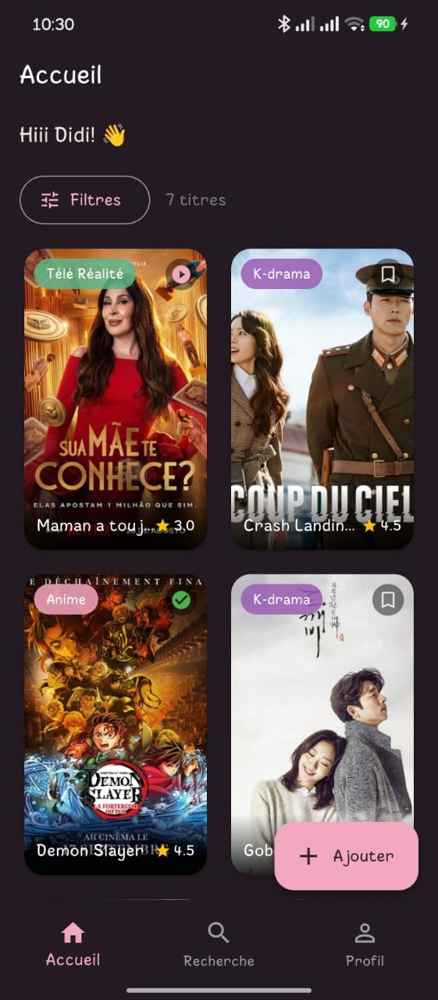
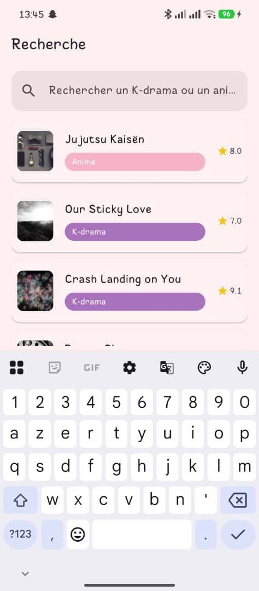
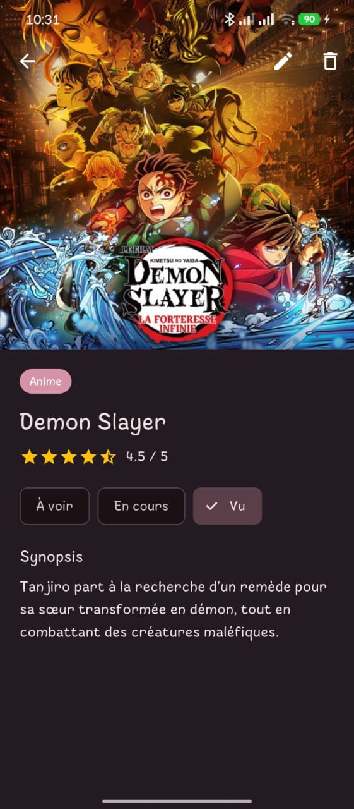
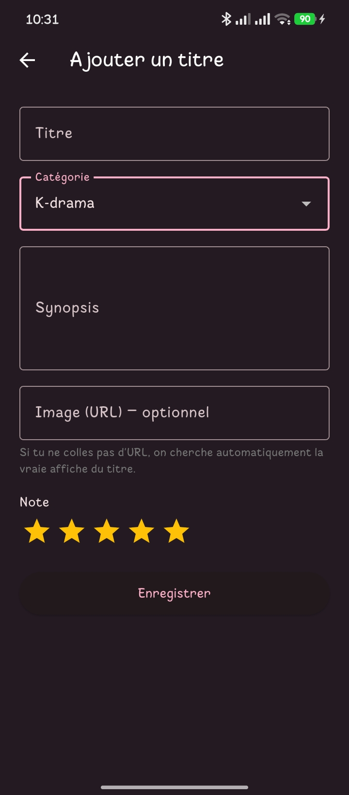
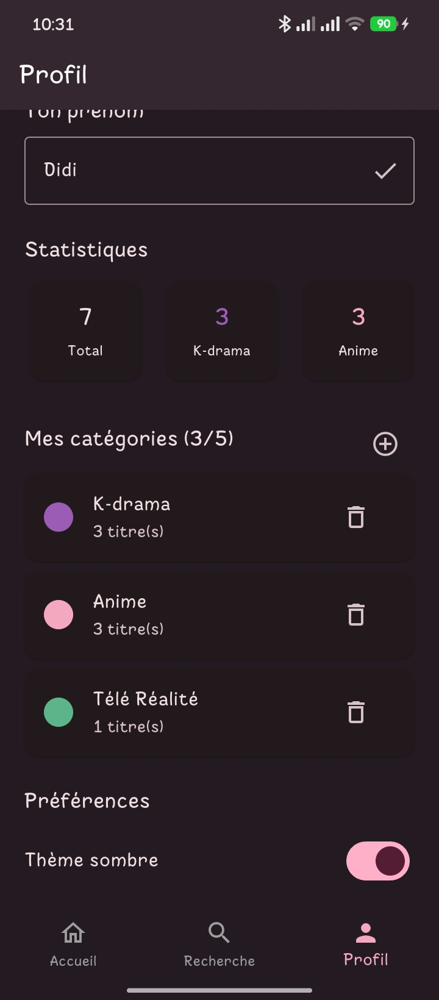

# Didi's Pop

[](https://github.com/Didi17ane/Didi-s-Pop_V2/actions/workflows/ci.yml)


Application Flutter pour suivre des K-dramas et des animés.

## À propos du projet

**Didi's Pop** est une application Flutter multi-écrans permettant de gérer et suivre une liste personnelle de K-dramas et d'animés préférés. L'application démontre les concepts fondamentaux de Flutter : navigation multi-écrans, gestion d'état, formulaires avec validation, passage de paramètres et adaptation au thème clair/sombre.

### Fonctionnalités principales

- 📱 **Navigation multi-écrans** avec GoRouter (routes nommées)
- 🏠 **Accueil** : grille de titres avec filtrage par catégorie, note et statut
- 🔍 **Recherche** : écran dédié avec champ de recherche textuel
- 📝 **Détail** : affichage complet avec image, note, synopsis
- ➕ **Ajout** : formulaire avec validation (titre, catégorie, note, synopsis)
- 👤 **Profil** : statistiques et gestion du thème clair/sombre
- 🎨 **Thème** : support complet des thèmes clair et sombre
- 🌍 **Internationalisation** : interface disponible en français et en anglais (`flutter_localizations`)
- ♿ **Accessibilité** : labels `Semantics` sur les cartes de titres, le badge de statut et les étoiles de notation
- ⚡ **Performance** : listes/grilles en `.builder` (lazy), images mises en cache et redimensionnées (`cached_network_image`)

## Lancer le projet

1. Cloner le dépôt.
2. Installer les dépendances.

```bash
flutter pub get
```

3. Générer les fichiers de traduction (nécessaire après un `flutter pub get`
   ou toute modification des fichiers `.arb`).

```bash
flutter gen-l10n
```

4. Lancer l'application.

```bash
flutter run
```

## Architecture et structure

```
lib/
  main.dart              # Point d'entrée de l'application
  app_state.dart         # Gestion d'état centralisée (ChangeNotifier)
  l10n/
    app_fr.arb            # Chaînes françaises (locale de référence)
    app_en.arb            # Chaînes anglaises
    app_localizations.dart # Généré par `flutter gen-l10n` (ne pas éditer à la main)
  models/
    watchable.dart        # Modèle de données (Watchable) et statuts de visionnage
    app_category.dart     # Modèle de catégorie personnalisable
  data/
    sample_data.dart      # Données d'exemple pour le démarrage
  theme/
    app_theme.dart        # Définition des thèmes clair et sombre
  router/
    app_router.dart       # Configuration des routes avec GoRouter
  services/
    poster_service.dart   # Récupération automatique d'affiches (Jikan/TMDB)
  screens/
    home_screen.dart      # Écran d'accueil avec grille, filtres et tri
    search_screen.dart    # Écran de recherche
    detail_screen.dart    # Écran de détail d'un titre
    add_screen.dart       # Écran d'ajout/modification avec formulaire
    profile_screen.dart   # Écran de profil, catégories et thème
    root_shell.dart        # Shell de navigation (BottomNavigationBar)
  widgets/
    poster_card.dart      # Carte affichant le poster et les infos
    category_chip.dart    # Badge de catégorie
    star_rating.dart       # Notation en étoiles (lecture seule ou interactive)
    section_title.dart    # Titre de section réutilisable

test/                    # Tests unitaires et de widgets
  models/
    watchable_test.dart
    app_category_test.dart
  app_state_test.dart
  screens/
    home_screen_test.dart
  widgets/
    category_chip_test.dart
    star_rating_test.dart
    poster_card_test.dart

integration_test/        # Tests d'intégration (parcours complets)
  app_flow_test.dart

.github/workflows/
  ci.yml                 # Lint + tests unitaires/widgets + tests d'intégration
```

### Points clés de l'architecture

- **Modèle de données** : `Watchable` représente un K-drama ou anime avec id, titre, catégorie, note, image et synopsis
- **Gestion d'état** : `AppState` (ChangeNotifier) gère la liste d'éléments et le mode thème
- **Navigation** : GoRouter avec routes nommées (`/`, `/detail/:id`, `/add`) et passage de paramètres via `extra`
- **Widgets réutilisables** : `CategoryChip`, `PosterCard`, `SectionTitle` pour éviter la duplication
- **Responsivité** : adaptée mobile et tablette (2 colonnes mobile, 4+ tablette)

## Écrans

Captures des écrans principaux du projet :

### Accueil


### Recherche


### Détail


### Ajout


### Profil


## Tests

Le projet inclut des tests unitaires, de widgets et d'intégration :

```bash
# Tests unitaires et de widgets, avec couverture
flutter test --coverage

# Tests d'intégration (parcours complets à travers plusieurs écrans)
# Nécessite un device non-web (le mode web n'est pas supporté par
# `flutter test integration_test`). Si tu n'as pas d'émulateur Android,
# active le support desktop Linux une fois pour toutes :
#   flutter config --enable-linux-desktop
#   sudo apt install ninja-build libgtk-3-dev
flutter test integration_test -d linux
# ou, avec un émulateur Android déjà lancé :
flutter test integration_test -d emulator-5554
```

### Couverture des tests

- **Tests unitaires** (13) : modèle `Watchable`, modèle `AppCategory`
  (couleurs, sérialisation), logique d'`AppState` (ajout/suppression de
  titres et de catégories, doublons, limite de catégories, thème, prénom).
- **Tests de widgets** (8) : `HomeScreen` (grille, feuille de filtres),
  `CategoryChip`, `StarRating` (interaction et lecture seule), `PosterCard`
  (affichage et accessibilité).
- **Tests d'intégration** (2) : ajout d'un titre depuis l'accueil jusqu'à
  sa persistance après redémarrage, changement de thème depuis le profil
  et persistance.

## Intégration continue

Le workflow [`ci.yml`](.github/workflows/ci.yml) s'exécute à chaque push
et pull request sur `main` :

1. `dart format --set-exit-if-changed` : vérifie le formatage.
2. `flutter analyze --fatal-infos` : analyse statique stricte (0 warning).
3. `flutter test --coverage` : tests unitaires et de widgets.
4. `flutter test integration_test` : tests d'intégration.

## Accessibilité et internationalisation

- Les éléments interactifs importants (cartes de titres, étoiles de
  notation, badge de statut) portent un `Semantics.label` explicite pour
  les lecteurs d'écran.
- L'interface (navigation, accueil, ajout, recherche, profil) est
  disponible en français et en anglais via `flutter_localizations` et des
  fichiers `.arb` (`lib/l10n/`). La locale suit celle de l'appareil.

## Dépendances principales

- **go_router** : navigation déclarative avec GoRouter
- **shared_preferences** : persistance locale des titres, catégories, thème et prénom
- **http** : appels aux API Jikan/TMDB pour récupérer une affiche automatiquement
- **cached_network_image** : mise en cache et redimensionnement des affiches
- **flutter_localizations** / **intl** : traduction FR/EN
- **flutter_test** / **integration_test** : tests unitaires, de widgets et d'intégration
- **flutter_lints** : linting des bonnes pratiques Flutter

## Notes de développement

- Aucune donnée n'est en dur dans les widgets ; tout provient de `models/` et `data/`
- Les contrôleurs de formulaire sont correctement nettoyés dans `dispose()`
- Les images réseau passent par `CachedNetworkImage` (cache disque/mémoire
  + `memCacheWidth` adapté à la taille affichée) pour limiter le jank et la
  consommation mémoire dans les listes
- Les listes/grilles utilisent systématiquement `.builder` pour un rendu
  paresseux (lazy)
- La navigation utilise les patterns recommandés par GoRouter (routes nommées, `context.push()`, etc.)
- L'écran de recherche offre un filtrage textuel complet
- Le passage des paramètres en détail utilise `state.extra` pour plus de flexibilité

## À propos

Projet Flutter pour suivre des K-dramas et des animés, avec navigation, recherche, ajout d'éléments et thème clair/sombre.

## Changelog

L'historique détaillé des versions se trouve dans [CHANGELOG.md](CHANGELOG.md).

### Architecture (mise à jour)

Les écrans (`HomeScreen`, `SearchScreen`, `ProfileScreen`, `AddScreen`) reçoivent maintenant directement l'objet `AppState` (au lieu de listes/callbacks séparés) et s'enveloppent dans un `AnimatedBuilder(animation: appState, ...)` pour se reconstruire automatiquement dès que l'état change (nouvel item, thème, prénom) — sans passer par une re-navigation GoRouter.